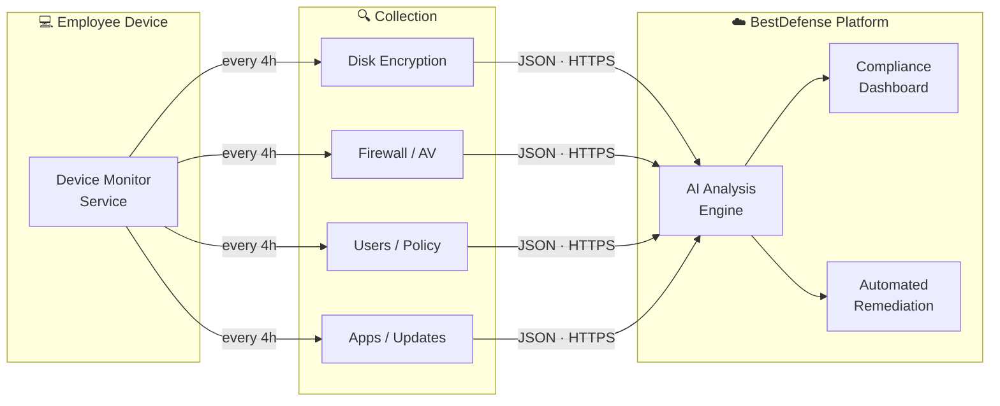

<div align="center">


<br />

### Providing Tomorrow's Cyber tools. Today

*Open-source device compliance agent &nbsp;·&nbsp; Part of the [BestDefense](https://bestdefense.io) AI Security Platform*

<br />

[](https://github.com/danbadds38/bestdefense-device-monitor/actions/workflows/release.yml)
[](https://github.com/danbadds38/bestdefense-device-monitor/releases/latest)
[](https://go.dev)
[](LICENSE)
[](https://github.com/danbadds38/bestdefense-device-monitor/releases/latest)
[](https://bestdefense.io)
[](https://bestdefense.io)

</div>

---

**BestDefense Device Monitor** is a lightweight, open-source security compliance agent that continuously audits the security posture of employee machines — then ships structured findings to the [BestDefense platform](https://bestdefense.io) for AI-powered analysis and automated remediation.

Zero manual pentests. Zero waiting. Continuous, verified visibility across your entire fleet.

> **Full transparency.** Read the source. Run `check` to see the exact JSON before anything is sent. Every field is documented. Nothing is hidden. See [Example](example/collection.json).

---

## ⬇️  Download

> **Replace `danbadds38`** in the links below with your GitHub organization name after pushing this repo.

<div align="center">

<table>
  <thead>
    <tr>
      <th align="left">Platform</th>
      <th align="center">Binary / Package</th>
      <th align="center">SHA256</th>
    </tr>
  </thead>
  <tbody>
    <tr>
      <td>&nbsp; <strong>Windows x64</strong></td>
      <td align="center"><a href="https://github.com/danbadds38/bestdefense-device-monitor/releases/latest/download/bestdefense-device-monitor-windows-amd64.exe"><code>bestdefense-device-monitor-windows-amd64.exe</code></a></td>
      <td align="center"><a href="https://github.com/danbadds38/bestdefense-device-monitor/releases/latest/download/bestdefense-device-monitor-windows-amd64.exe.sha256">checksum</a></td>
    </tr>
    <tr>
      <td>&nbsp; <strong>macOS Apple Silicon</strong> <sup>M1–M4</sup></td>
      <td align="center"><a href="https://github.com/danbadds38/bestdefense-device-monitor/releases/latest/download/bestdefense-device-monitor-darwin-arm64"><code>bestdefense-device-monitor-darwin-arm64</code></a></td>
      <td align="center"><a href="https://github.com/danbadds38/bestdefense-device-monitor/releases/latest/download/bestdefense-device-monitor-darwin-arm64.sha256">checksum</a></td>
    </tr>
    <tr>
      <td>&nbsp; <strong>macOS Intel</strong></td>
      <td align="center"><a href="https://github.com/danbadds38/bestdefense-device-monitor/releases/latest/download/bestdefense-device-monitor-darwin-amd64"><code>bestdefense-device-monitor-darwin-amd64</code></a></td>
      <td align="center"><a href="https://github.com/danbadds38/bestdefense-device-monitor/releases/latest/download/bestdefense-device-monitor-darwin-amd64.sha256">checksum</a></td>
    </tr>
    <tr>
      <td>&nbsp; <strong>Linux x64</strong></td>
      <td align="center">
        <a href="https://github.com/danbadds38/bestdefense-device-monitor/releases/latest/download/bestdefense-device-monitor-linux-amd64"><code>binary</code></a>
        &nbsp;·&nbsp;
        <a href="https://github.com/danbadds38/bestdefense-device-monitor/releases/latest/download/bestdefense-device-monitor_amd64.deb"><code>.deb</code></a>
        &nbsp;·&nbsp;
        <a href="https://github.com/danbadds38/bestdefense-device-monitor/releases/latest/download/bestdefense-device-monitor.x86_64.rpm"><code>.rpm</code></a>
      </td>
      <td align="center"><a href="https://github.com/danbadds38/bestdefense-device-monitor/releases/latest/download/bestdefense-device-monitor-linux-amd64.sha256">checksum</a></td>
    </tr>
    <tr>
      <td>&nbsp; <strong>Linux ARM64</strong></td>
      <td align="center"><a href="https://github.com/danbadds38/bestdefense-device-monitor/releases/latest/download/bestdefense-device-monitor-linux-arm64"><code>bestdefense-device-monitor-linux-arm64</code></a></td>
      <td align="center"><a href="https://github.com/danbadds38/bestdefense-device-monitor/releases/latest/download/bestdefense-device-monitor-linux-arm64.sha256">checksum</a></td>
    </tr>
  </tbody>
</table>

*All release artifacts include SHA256 checksums. Always verify before deploying to production.*

</div>

---

## 🏗️  How It Fits Together

The device monitor is the **endpoint visibility layer** of the BestDefense platform. It feeds real-time compliance data into the same AI engine that powers continuous penetration testing and automated remediation.



**The BestDefense product suite:**

| Product | What it does |
|---------|-------------|
| [**Vortex**](https://bestdefense.io/vortex) | AI-driven continuous pentesting with exploit validation and automated code/config fixes |
| [**Maelstrom**](https://bestdefense.io/maelstrom) | Scale, load, and resilience testing |
| **Device Monitor** *(this repo)* | Endpoint compliance — feeds posture data into the platform |

> 95% reduction in attack surface scoping &nbsp;·&nbsp; 90% fewer alerts &nbsp;·&nbsp; 85% faster remediation — [bestdefense.io](https://bestdefense.io)

---

## 🔍  Audit Before You Install

Run a dry-run to see the **exact JSON payload** that would be sent — no service installation, no background process, no network traffic:

```sh
# Windows (PowerShell — no elevation needed)
.\bestdefense-device-monitor-windows-amd64.exe check

# macOS
chmod +x bestdefense-device-monitor-darwin-arm64
./bestdefense-device-monitor-darwin-arm64 check

# Linux
chmod +x bestdefense-device-monitor-linux-amd64
./bestdefense-device-monitor-linux-amd64 check
```

Inspect the output. Read the source. Check [docs/DATA_COLLECTED.md](docs/DATA_COLLECTED.md). When you're satisfied, add `--send` to also transmit, or proceed with a full `install`.

---

## 📋  What It Collects

Scoped entirely to **security configuration** — not behavior, content, or activity.

| Security Check |  Windows |  macOS |  Linux |
|:---|:---|:---|:---|
| **Disk Encryption** | BitLocker status per volume | FileVault status | LUKS / dm-crypt detection |
| **Antivirus** | Windows Defender + definition age | XProtect version + installed AV apps | CrowdStrike · SentinelOne · Carbon Black · ClamAV + 5 others |
| **Firewall** | Domain / Private / Public profiles | Application firewall state | ufw · firewalld · iptables |
| **Screen Lock** | Screensaver timeout + password-on-resume | Idle sleep / screensaver lock settings | GNOME · KDE · X11 idle timeout |
| **Software Updates** | Windows Update auto-install policy | SoftwareUpdate auto-download prefs | apt unattended-upgrades · dnf-automatic · openSUSE |
| **Installed Applications** | Registry uninstall keys (`HKLM` + `HKCU`) | `/Applications` via `system_profiler` | `dpkg-query` · `rpm -qa` |
| **Local Users** | `NetUserEnum` + admin group members | `dscl` + `dseditgroup` | `/etc/passwd` + sudo / wheel / admin groups |
| **Password Policy** | `NetUserModalsGet` + LSA policy | `pwpolicy` global hash | `/etc/login.defs` + PAM `pam_pwquality` + `pam_faillock` |
| **Hardware & OS** | WMI `Win32_*` classes | `system_profiler` + `sw_vers` | `/proc/cpuinfo` · `/proc/meminfo` · `/etc/os-release` |
| **Network Interfaces** | `net.Interfaces()` | `net.Interfaces()` | `net.Interfaces()` |
| **System Uptime** | WMI `LastBootUpTime` | `sysctl kern.boottime` | `/proc/uptime` |

Full field-by-field documentation → [docs/DATA_COLLECTED.md](docs/DATA_COLLECTED.md)

---

## ⚡  Installation

### &nbsp; Windows

> **Requirements:** Windows 10 / 11 &nbsp;·&nbsp; Administrator privileges

```powershell
.\bestdefense-device-monitor-windows-amd64.exe install --key YOUR_REGISTRATION_KEY
```

<details>
<summary>Post-install details</summary>

- Runs as a **Windows Service** (`BestDefenseMonitor`) under `LocalSystem`
- Auto-starts on boot &nbsp;·&nbsp; checks in every **4 hours** (configurable)
- Config: `C:\ProgramData\BestDefense\config.json`
- Logs: `C:\ProgramData\BestDefense\logs\agent.log` + Windows Event Log source `BestDefenseMonitor`

```powershell
# Service management
net start BestDefenseMonitor
net stop BestDefenseMonitor
sc query BestDefenseMonitor
```

</details>

---

### &nbsp; macOS

> **Requirements:** macOS 11 Big Sur or later &nbsp;·&nbsp; root

```sh
# Apple Silicon (M1 / M2 / M3 / M4)
chmod +x bestdefense-device-monitor-darwin-arm64
sudo ./bestdefense-device-monitor-darwin-arm64 install --key YOUR_REGISTRATION_KEY

# Intel
chmod +x bestdefense-device-monitor-darwin-amd64
sudo ./bestdefense-device-monitor-darwin-amd64 install --key YOUR_REGISTRATION_KEY
```

<details>
<summary>Post-install details</summary>

- Installs as a **launchd daemon**: `/Library/LaunchDaemons/io.bestdefense.monitor.plist`
- Runs as root &nbsp;·&nbsp; starts at boot &nbsp;·&nbsp; auto-restarts on failure
- Config: `/Library/Application Support/BestDefense/config.json`
- Logs: `/Library/Application Support/BestDefense/logs/agent.log`

```sh
# Service management
sudo launchctl kickstart -k system/io.bestdefense.monitor
sudo launchctl stop system/io.bestdefense.monitor
sudo launchctl list io.bestdefense.monitor
```

> **Gatekeeper:** Without a Developer ID certificate, macOS will block unsigned binaries. IT admins can authorize via MDM configuration profile (recommended) or `sudo spctl --add <binary>`. See [docs/SIGNING.md](docs/SIGNING.md) for the signing roadmap.

</details>

---

### &nbsp; Linux

<details open>
<summary><strong>Debian / Ubuntu — <code>.deb</code></strong></summary>

```sh
sudo dpkg -i bestdefense-device-monitor_amd64.deb
sudo bestdefense-device-monitor install --key YOUR_REGISTRATION_KEY
```

</details>

<details>
<summary><strong>RHEL / Fedora / CentOS — <code>.rpm</code></strong></summary>

```sh
sudo rpm -i bestdefense-device-monitor.x86_64.rpm
sudo bestdefense-device-monitor install --key YOUR_REGISTRATION_KEY
```

</details>

<details>
<summary><strong>Any distro — raw binary</strong></summary>

```sh
# x64
chmod +x bestdefense-device-monitor-linux-amd64
sudo ./bestdefense-device-monitor-linux-amd64 install --key YOUR_REGISTRATION_KEY

# ARM64
chmod +x bestdefense-device-monitor-linux-arm64
sudo ./bestdefense-device-monitor-linux-arm64 install --key YOUR_REGISTRATION_KEY
```

</details>

<details>
<summary>Post-install details</summary>

- Runs as a **systemd service**: `bestdefense-monitor.service`
- Enabled at boot &nbsp;·&nbsp; `Restart=always`
- Config: `/var/lib/bestdefense/config.json`
- Logs: `/var/lib/bestdefense/logs/agent.log` + journald

```sh
# Service management
sudo systemctl status bestdefense-monitor
sudo systemctl restart bestdefense-monitor
journalctl -u bestdefense-monitor -f
```

</details>

---

## 🗑️  Uninstall

```sh
# Windows (Admin PowerShell)
.\bestdefense-device-monitor-windows-amd64.exe uninstall

# macOS / Linux
sudo ./bestdefense-device-monitor-<platform> uninstall
```

The service is stopped and removed. Config and logs are preserved — delete the config directory manually if desired.

---

## ⚙️  Configuration

| Platform | Config file |
|:---------|:------------|
|  Windows | `C:\ProgramData\BestDefense\config.json` |
|  macOS | `/Library/Application Support/BestDefense/config.json` |
|  Linux | `/var/lib/bestdefense/config.json` |

```json
{
  "registration_key": "cust_abc123xyz",
  "api_endpoint": "https://app.bestdefense.io/monitoring/employee/update",
  "check_interval_hours": 4,
  "log_level": "info"
}
```

Restart the service after any changes:

```sh
# Windows
net stop BestDefenseMonitor && net start BestDefenseMonitor

# macOS
sudo launchctl kickstart -k system/io.bestdefense.monitor

# Linux
sudo systemctl restart bestdefense-monitor
```

---

## 🏢  Enterprise Deployment

### &nbsp; Windows — Intune / SCCM / GPO

1. Distribute `bestdefense-device-monitor-windows-amd64.exe` via your MDM
2. Pre-stage `config.json` to `C:\ProgramData\BestDefense\` before the installer runs
3. Execute as `SYSTEM`:
   ```
   bestdefense-device-monitor-windows-amd64.exe install --key cust_abc123xyz
   ```

### &nbsp; macOS — Jamf / Mosyle / Kandji

1. Package the binary + pre-configured `config.json` as a `.pkg` or via MDM payload
2. Deploy a **Privacy Preferences Policy Control (PPPC)** profile for the binary
3. Use a **Configuration Profile** to bypass Gatekeeper (preferred over manual `spctl`)
4. Run install as a policy script:
   ```sh
   sudo /path/to/bestdefense-device-monitor-darwin-arm64 install --key cust_abc123xyz
   ```

### &nbsp; Linux — Ansible / Chef / Puppet / SaltStack

Deploy the `.deb` or `.rpm` via your configuration management tool. A single `install` call writes the systemd unit and enables the service atomically.

```yaml
# Ansible example
- name: Install BestDefense Device Monitor
  apt:
    deb: /tmp/bestdefense-device-monitor_amd64.deb

- name: Pre-stage configuration
  copy:
    src: files/bestdefense-config.json
    dest: /var/lib/bestdefense/config.json
    mode: '0600'

- name: Register agent with platform
  command: bestdefense-device-monitor install --key {{ bestdefense_key }}
  args:
    creates: /etc/systemd/system/bestdefense-monitor.service
```

---

## 🖥️  CLI Reference

```
bestdefense-device-monitor <command> [flags]

Commands:
  install    --key <key>   Install and start the monitoring service (requires elevation)
  uninstall                Stop and remove the service (config and logs preserved)
  check      [--send]      One-shot collection — prints full JSON payload to stdout
                            Add --send to also transmit to the BestDefense platform
  status                   Show service status and active configuration
  version                  Show version, build commit, and build timestamp
```

---

## 🔒  Security & Privacy

### Network behavior

The agent makes a single **outbound HTTPS POST** to `app.bestdefense.io` on each check cycle. That is the only network operation it performs.

- ✅ Outbound HTTPS only — no inbound ports, no listeners, no tunnels
- ✅ `check` command produces the exact bytes that would be transmitted — fully auditable
- ✅ Source code is the complete implementation — no precompiled blobs or native extensions
- ✅ Windows installer adds a Firewall outbound rule scoped to the binary path

### What the agent does **not** collect

| ❌ Never collected |
|:---|
| Browser history, saved passwords, or cookies |
| File contents — documents, source code, databases, media |
| Keystrokes, clipboard, or screen captures |
| Email, calendar, or messaging content |
| Network traffic or packet-level data |
| Location or GPS data |
| Camera, microphone, or peripheral access |

### Code signing

Current release binaries are unsigned. Windows SmartScreen and macOS Gatekeeper will warn on first execution — expected behavior for unsigned binaries, bypassable by IT admins via MDM policy. Signed releases are on the roadmap.

---

## 🔨  Building from Source

**Requirements:** Docker with BuildKit enabled. No local Go toolchain needed.

```sh
# Clone
git clone https://github.com/danbadds38/bestdefense-device-monitor.git
cd bestdefense-device-monitor

# Build all 5 platform targets at once
make -f docker/Makefile build-all

# Build a single platform
make -f docker/Makefile build-windows
make -f docker/Makefile build-darwin-arm64
make -f docker/Makefile build-darwin-amd64
make -f docker/Makefile build-linux-amd64
make -f docker/Makefile build-linux-arm64

# Vet + test across all platforms
make -f docker/Makefile vet-all
make -f docker/Makefile test

# Build Linux packages (.deb + .rpm)
make -f docker/Makefile package-linux
```

Outputs land in `dist/`:

```
dist/
├── bestdefense-device-monitor-windows-amd64.exe
├── bestdefense-device-monitor-darwin-amd64
├── bestdefense-device-monitor-darwin-arm64
├── bestdefense-device-monitor-linux-amd64
├── bestdefense-device-monitor-linux-arm64
├── bestdefense-device-monitor_amd64.deb
└── bestdefense-device-monitor.x86_64.rpm
```

### CI / CD

GitHub Actions runs `vet-all → test → build-all` on every PR. Pushing a version tag (`v*`) triggers the full release pipeline: all 5 binaries + `.deb` + `.rpm` + SHA256 checksums, published automatically as a GitHub Release.

```sh
git tag v1.0.0
git push origin v1.0.0
# → CI runs → Release created → artifacts attached
```

---

## 🌐  Links

<div align="center">

| | |
|:---|:---|
| 🌍 **Website** | [bestdefense.io](https://bestdefense.io) |
| ⚔️ **Vortex** — AI Pentesting | [bestdefense.io](https://bestdefense.io) |
| 📊 **Platform** | [app.bestdefense.io](https://app.bestdefense.io) |
| 📧 **Contact** | [contact@bestdefense.io](mailto:contact@bestdefense.io) |
| 📋 **Data Collected** | [docs/DATA_COLLECTED.md](docs/DATA_COLLECTED.md) |
| 🏷️ **Releases** | [github.com/danbadds38/bestdefense-device-monitor/releases](https://github.com/danbadds38/bestdefense-device-monitor/releases) |

</div>

---

## 📄  License

MIT — see [LICENSE](LICENSE)

---

<div align="center">

<sub>Built by the <a href="https://bestdefense.io">BestDefense, Inc.</a> team &nbsp;❤️&nbsp; <strong>Detect. Defend. Deter.</strong></sub>

</div>
